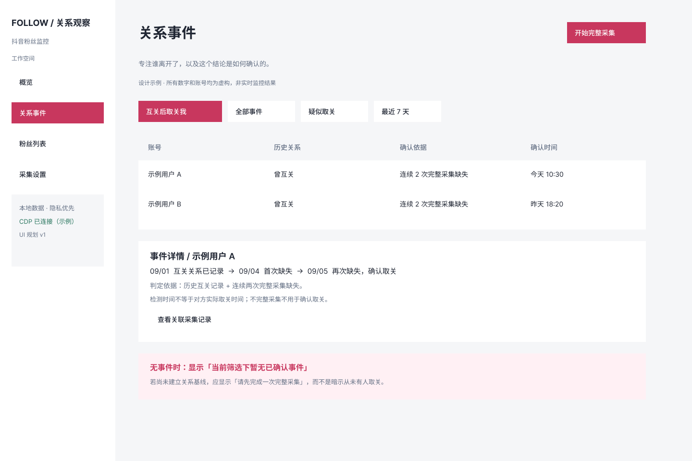
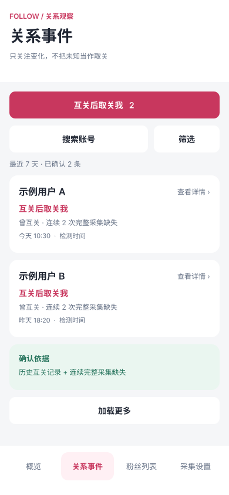
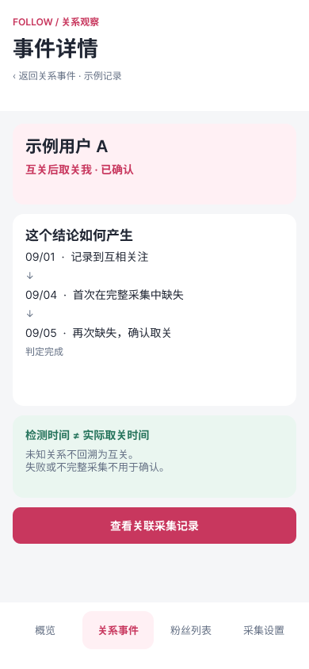

# 抖音粉丝监控

**粉丝数告诉你变化了多少，这里帮你记住是谁。**

[在线体验](https://exordor.github.io/douyin-follower-monitor) · [界面与 Figma 设计](docs/design/README.md) · [使用指南](docs/usage.md)

## 不只是少了一个数字

打开抖音，粉丝少了一个。你可能想知道：是刚认识的人，还是曾经互相关注的朋友？

有时数字根本没变——有人来了，也有人离开了。只看总数，很难知道发生了什么；靠记忆翻列表，也很难分清一个人是取关了，还是只是换了昵称。

这个项目为你的粉丝列表留下一份持续更新的记录。下一次查看时，你不用重新回忆，只需要看看这段时间的变化。

## 把你在意的变化放在前面

- **谁来了**：记录新增粉丝，以及离开后重新出现的人。
- **谁离开了**：区分疑似取关和经重复采集确认的取关。
- **谁曾经和你互关**：单独展示“互关后取关我”，不淹没在普通事件里。
- **谁只是改了名字**：保留昵称变化，避免把熟悉的人误认成陌生账号。

“互关后取关我”是这个项目优先展示的事件。但它不会替你猜测：必须先记录到明确的互关关系，再根据后续完整采集判断变化。开始记录之前的关系，无法回溯还原。

## 一次没看到，不急着下结论

第一次完整采集，建立记录。之后再次采集，才有变化可比较。

一个账号首次缺失时，只标为“疑似取关”；默认连续两次完整采集都缺失，才确认取关。失败或不完整的采集不用于确认。

这些记录反映的是**你何时发现变化**，不是对方实际操作的准确时间。隐藏或暂时不可见的账号，也可能让列表与主页粉丝数不同。

## 看看它的样子

概览看整体变化，关系事件看谁离开，粉丝列表找具体账号，采集设置管理连接与记录。手机端使用底部导航和卡片列表。

*下图为 Figma 设计稿，账号和数字均为虚构示例；实际功能差异见[设计文档](docs/design/README.md)。*



<p>
  
  
</p>

[在线演示](https://exordor.github.io/douyin-follower-monitor)使用虚构数据，不连接你的抖音账号。

## 从第一次记录开始

准备好 Node.js 24+ 和 Chrome，在下载或克隆后的项目目录中运行：

```bash
npm install
npm run dashboard
```

1. 打开 [本地仪表盘](http://127.0.0.1:4573)，进入“采集设置”，选择 **CDP**。
2. 点击“打开采集浏览器”。已有项目 Cookie 会自动载入；没有登录态时，在专用浏览器中登录自己的抖音账号。
3. 选择“全量”并启动采集，建立第一份记录。以后再采集，就能比较变化。

专用浏览器使用固定配置，历史记录保存在本机。遇到验证码时需手动完成。采集由电脑执行；手机访问需要额外配置安全连接，并非安装后自动可用。

## 你的关系记录，留在你这里

粉丝历史和登录数据保存在本机，不由本工具上传到第三方服务。项目只读取你有权访问的可枚举列表，不补全隐藏账号，也不绕过登录或验证码。

这是非官方、开源的个人工具，与抖音或字节跳动无关。请用于自己的账号，并遵守平台规则；分享截图或提交问题前，请去除真实账号与 Cookie 信息。

---

[使用与技术参考](docs/usage.md) · [常见问题](docs/troubleshooting.md) · [Figma 设计](docs/design/README.md) · [Agent Skills](docs/agent-skills.md) · [参与贡献](CONTRIBUTING.md) · [MIT 许可](LICENSE)
