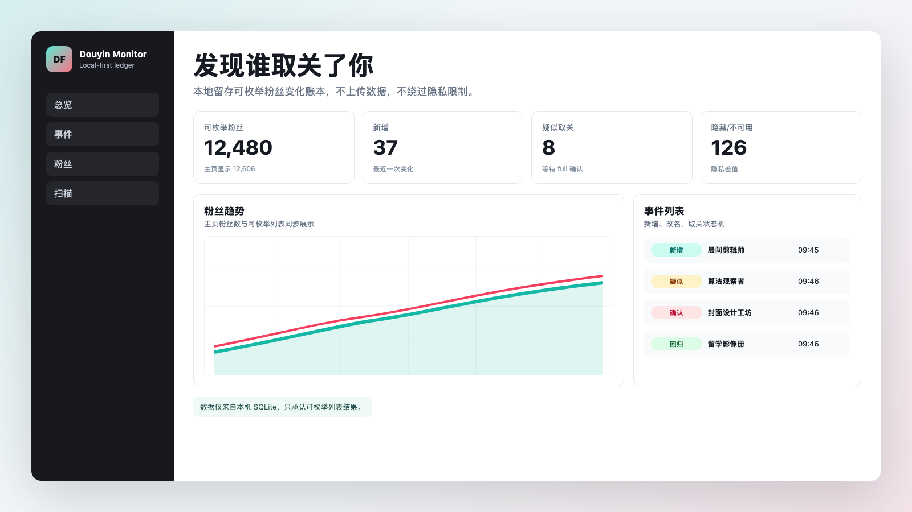
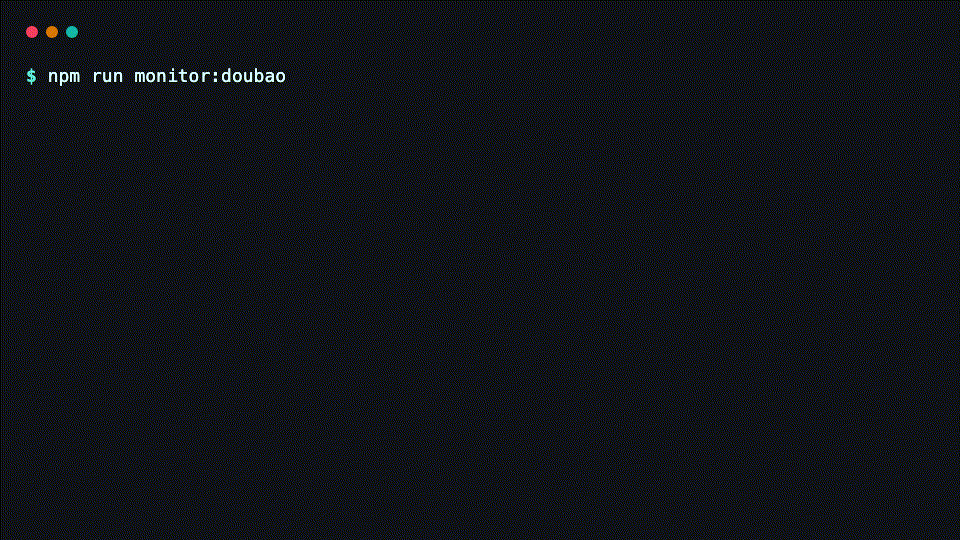
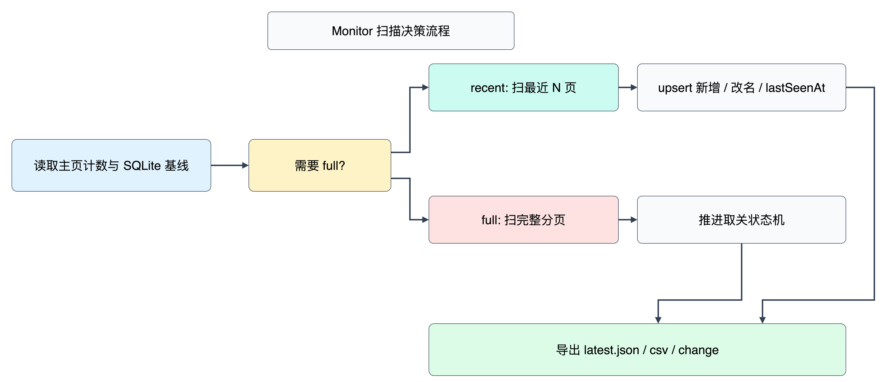
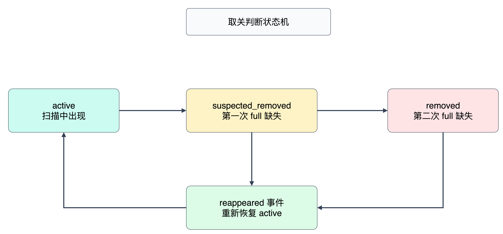

# Douyin Follower Monitor



[](https://github.com/exordor/douyin-follower-monitor/actions/workflows/ci.yml)
[](LICENSE)
[](package.json)
[](#隐私边界)

发现谁取关了你。本项目通过你已经登录的本机浏览器读取抖音当前账号可枚举的粉丝列表，用 SQLite 长期记录粉丝变化，并提供本地 Web 仪表盘查看新增、改名、疑似取关、确认取关、互关后取关我和重新出现。

> 非官方工具。本项目不属于抖音或字节跳动，不使用官方 logo，不绕过登录、签名或隐私限制。请只用于你有权访问的账号，并遵守平台规则。

## Demo



```bash
npm install
npm run doctor
npm run monitor
npm run dashboard
```

打开本地仪表盘：

```text
http://127.0.0.1:4573
```

公开演示站使用 mock 数据，不包含真实粉丝信息：

[https://exordor.github.io/douyin-follower-monitor](https://exordor.github.io/douyin-follower-monitor)

## 功能

- 四页仪表盘：`#overview` 概览、`#events` 关系事件、`#followers` 粉丝列表、`#settings` 采集设置；旧的 `#setup` / `#runs` 入口仍会进入设置页。
- 关系事件默认优先查看“互关后取关我”，可切换全部事件或疑似取关；切换页面保留当前筛选和分页，刷新后恢复默认筛选。
- 采集运行和人工验证状态跨页面提示；连接帮助默认折叠，运行记录与快照对比集中在采集设置中。

- `monitor` 自动决策：无基线先 `full`，日常 `recent`，粉丝数下降或 full 过期时自动 full。
- `recent` 轻量扫描：默认只扫最近 5 页，连续命中已知粉丝后提前停止。
- `full` 权威可枚举基线：完整扫分页，并推进疑似/确认取关状态机。
- 互关取关提醒：从粉丝接口的明确关系信号建立前瞻性基线，在确认取关时生成独立高优先级事件。
- SQLite 长期状态：`followers`、`scan_runs`、`follower_events` 三张表记录历史。
- 中断保护：采集过程中持续写入 `data/in-progress/latest.partial.*`。
- 本地 Web 仪表盘：趋势图、事件图、状态分布、粉丝/事件/扫描表格。
- Cookie 登录态导入：支持 cookie-manager 无损 JSON，让 Playwright/CDP 在采集前注入 `douyin.com` cookie。
- JSON/CSV 双写导出：保留人工查看和脚本兼容能力。

## Agent Skills

本项目内置公开可用的 Agent Skill Pack：

- Codex：`$douyin-monitor`、`$douyin-monitor-control`
- Claude Code：`/douyin-monitor`、`/douyin-monitor-control`

Repo 内使用无需安装。clone 仓库后，在项目目录打开 Codex 或 Claude Code 即可发现 `.agents/skills/` 和 `.claude/skills/`。

全局安装：

```bash
npm run skills:install:user
```

卸载：

```bash
npm run skills:uninstall:user
```

贡献 skill 时修改 `agent-skills/douyin-monitor-pack/`，再同步生成平台目录：

```bash
npm run skills:sync
npm run test:skills
```

`douyin-monitor` 默认只读；`douyin-monitor-control` 只允许固定 allowlist action，mutating action 没有 `--yes` 时只做 dry-run。详细说明见 [Agent Skills](docs/agent-skills.md)。

## 工作原理



API 模式不会滚动 DOM，而是在当前抖音页面主执行环境里调用页面已加载的粉丝分页接口。它复用你的浏览器登录态和页面已有请求逻辑，通常比滚动粉丝弹窗快得多。

```bash
npm run monitor
```

常用脚本：

```bash
npm run doctor
npm run scan:recent
npm run scan:full
npm run monitor
npm run dashboard:dev
```

## Browser Runtime

采集层通过 runtime adapter 连接已经登录的浏览器。默认 `auto` 规则是：传入 `--cdp-url` 或 `DOUYIN_CDP_URL` 时使用 CDP；否则使用 Playwright 持久 profile。

| Runtime | 适用场景 | Cookie 导入 | 示例 |
| --- | --- | --- | --- |
| `playwright` | 跨平台默认入口，使用 `.douyin-browser` 持久 profile，首次运行需要登录 | 支持 | `npm run monitor` |
| `cdp` | 复用本机 CDP；未启动时自动打开专用 Chrome | 支持 | `DOUYIN_CDP_URL=http://127.0.0.1:9222 npm run monitor` |

CDP 采集现在会自动打开专用 Chrome，也可在「采集设置」点击「打开采集浏览器」。两种入口都会载入项目已导入的 Cookie 并刷新目标页。默认使用 `$HOME/.douyin-cdp-profile` 持久保存浏览器状态，不关闭日常 Chrome。仅在 Cookie 失效或出现验证码时需手动处理；没有 Cookie 时可手动登录。已有 CDP 浏览器会直接复用。

可选环境变量：`DOUYIN_CHROME_PATH` 指定 Chrome 可执行文件，`DOUYIN_CDP_PROFILE` 指定专用数据目录（不要使用日常 Chrome 的默认目录）。本机端口被占用、配置目录锁定或启动超时会明确报错，不自动杀进程或删除锁。远程 CDP 仍仅连接，不自动启动。电脑休眠期间不能采集。

手动启动示例（通常不再需要）：

```bash
/Applications/Google\ Chrome.app/Contents/MacOS/Google\ Chrome \
  --remote-debugging-port=9222 \
  --user-data-dir="$HOME/.douyin-cdp-profile"

DOUYIN_CDP_URL=http://127.0.0.1:9222 npm run monitor
```

## 稳定性最佳实践

开源通用场景推荐按这个顺序选择 runtime：

1. 首选 `cdp`：连接已登录的 Chrome/Edge/Chromium，复用真实浏览器会话、cookie 和扩展环境。
2. 次选 `playwright`：使用持久 profile，并可导入 cookie-manager 无损 JSON。

Dashboard 的“Runtime 健康”卡片会根据当前 runtime、Cookie 登录态和验证码等待状态给出建议。Cookie 只能复用你已经拥有的登录态，不能保证免验证码；如果平台要求验证，请人工完成。项目不实现验证码识别、模拟拖动、代理池规避或第三方打码。

遇到验证码、Cookie 导入、CDP、Playwright profile、API runtime 或扫描中断问题时，请先阅读 [Troubleshooting](docs/troubleshooting.md)。

## Cookie 登录态

如果你使用 [Local Cookie Manager](https://github.com/exordor/sunbeam-cookie-jar) 导出了抖音 cookie，可以把无损 JSON 用作平台无关登录态。项目只接受 `format: "local-cookie-manager-v1"`，默认只导入对当前目标站点生效的 cookie，例如 `.douyin.com` 和 `www.douyin.com`；`creator.douyin.com`、`live.douyin.com` 这类无关子域 cookie 会被跳过。不导入 redacted 文件、过期 cookie 或分区 cookie。

CLI 示例：

```bash
node scripts/collect-followers.mjs \
  --runtime playwright \
  --cookie-file ./cookies-douyin.com.json \
  --api \
  --mode monitor

DOUYIN_COOKIE_FILE=./cookies-douyin.com.json npm run monitor
```

Dashboard 也可以在“采集控制”面板上传 cookie-manager 无损 JSON。文件会保存到本机 `data/auth/douyin-cookies.json`，权限设置为 `0600`，并且 `data/` 默认不会入库。上传和状态 API 不返回 cookie 名称或值，只返回导入数量摘要。

Cookie 注入不会主动刷新已打开的抖音页面；新 profile 或空白页会在首次导航前注入 cookie，避免因为页面刷新增加验证码触发概率。

如果抖音在新 profile 中显示“验证码中间页”，dashboard 启动的采集任务会进入“等待人工验证”状态并显示倒计时。请在弹出的浏览器窗口里手动完成验证码，任务会继续采集；项目不会自动处理或绕过验证码。默认等待 300 秒，可用 `DOUYIN_AUTH_WAIT_SECONDS=600 npm run dashboard` 或 `node scripts/serve-dashboard.mjs --auth-wait-seconds 600` 调整。

## 取关判断



只有 `full` 扫描能产生取关判断：

- 第一次 full 缺失：`suspected_removed`
- 下一次 full 仍缺失：`removed`
- 若该账号最近一次明确关系为互关：同时记录 `mutual_unfollowed_you`（仪表盘显示“互关后取关我”）
- 之后重新出现：恢复 `active`，记录 `reappeared`

`recent` 只记录新增、昵称变化和最后出现时间，不会因为只扫最近页就误判取关。

互关状态从升级后的第一次成功 API/CDP 扫描开始建立。升级前的旧记录统一保留为 `unknown`，不会回填或猜测历史互关关系；接口未提供明确关系值时也不会覆盖已经确认的关系。隐藏、暂时不可访问、单次缺失或未完成扫描都不会单独生成“互关后取关我”事件。

## Web 仪表盘

本地仪表盘默认读取：

- `data/followers.db`
- `data/latest.json`
- `data/latest.csv`
- `data/latest-change.json`

启动：

```bash
npm run dashboard
```

开发模式：

```bash
npm run dashboard:dev
```

本地 API：

- `GET /api/summary`
- `GET /api/timeline?days=30`
- `GET /api/event-daily?days=30`
- `GET /api/events?type=&q=&limit=&offset=`
- `GET /api/followers?status=&q=&limit=&offset=`
- `GET /api/runs?limit=100`
- `GET /api/runs/:runId`
- `GET /api/runs/:runId/events?type=&limit=&offset=`
- `GET /api/compare?from=<runId>&to=<runId>`
- `GET /api/export/latest.json`
- `GET /api/export/latest.csv`
- `GET /api/scan/status`
- `GET /api/scan/events`
- `POST /api/scan/start`
- `POST /api/scan/stop`
- `GET /api/runtime/health`
- `GET /api/auth/cookies/status`
- `POST /api/auth/cookies/import`
- `DELETE /api/auth/cookies`

`GET /api/scan/status` 会返回 `phase` 和 `authChallenge`。当 `phase=waiting_for_verification` 时，说明采集浏览器需要人工登录或验证码处理；这只是状态展示，不包含自动验证码处理能力。

自定义路径：

```bash
node --disable-warning=ExperimentalWarning scripts/serve-dashboard.mjs \
  --db data/followers.db \
  --out-dir data \
  --port 4573 \
  --runtime playwright
```

## 输出文件

- `data/followers.db`: SQLite 长期状态库
- `data/latest.json`: 当前 active 可枚举粉丝快照
- `data/latest.csv`: 当前 active 可枚举粉丝 CSV
- `data/latest-change.json`: 最近一次变化摘要
- `data/in-progress/latest.partial.json`: 采集中实时进度
- `data/in-progress/latest.partial.csv`: 采集中实时 CSV
- `data/auth/douyin-cookies.json`: 本地 cookie-manager 无损 JSON 导入文件
- `data/snapshots/*.json`: 历史快照
- `data/changes/*.json`: 历史差异

`data/` 默认被 `.gitignore` 忽略。不要提交真实粉丝数据。

## 诊断与调试

首次运行或提 issue 前，先跑本地诊断：

```bash
npm run doctor
npm run doctor -- --json
```

`doctor` 会检查 Node.js、依赖安装、Playwright Chromium、CDP 连接、Cookie 文件、数据目录写入和 SQLite 创建能力。JSON 输出只包含状态摘要，不包含 cookie 名称和值。

发布前隐私自检：

```bash
npm run privacy:check
```

提 issue 时可生成匿名调试包：

```bash
npm run debug:bundle
```

调试包写入 `debug/douyin-monitor-debug-*.zip`，只包含运行环境、schema、最近错误摘要等脱敏信息，不包含粉丝列表、cookie、完整本地路径或真实账号标识。分享前仍建议自行打开检查。

## 隐私边界

抖音账号可以关闭“在他人关注和粉丝列表公开出现”。这类账号可能计入主页粉丝数，但不会出现在可枚举粉丝列表中。

本项目只承认可枚举列表结果：

- 不尝试补全隐藏账号。
- 不绕过登录、风控、签名或隐私限制。
- 不上传 SQLite、JSON、CSV 或浏览器数据。
- 不在日志或 API 响应中输出 cookie 名称和值。
- `hiddenOrUnavailableCount = 主页粉丝数 - 可枚举粉丝数` 仅作为统计差值。

## 开发

```bash
npm ci
npm run check
npm run test:doctor
npm run test:state
npm run test:dashboard
npm run privacy:check
npm run test:debug-bundle
npm run test:skills
npm run dashboard:build
npm run pages:build
```

重新生成宣传资产和图：

```bash
npm run render:assets
```

## 贡献

欢迎提 issue 和 PR。请先阅读 [CONTRIBUTING.md](CONTRIBUTING.md) 和 [SECURITY.md](SECURITY.md)。

## License

[MIT](LICENSE)
