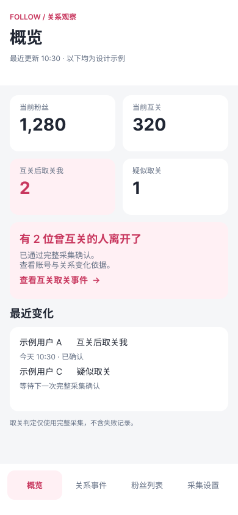
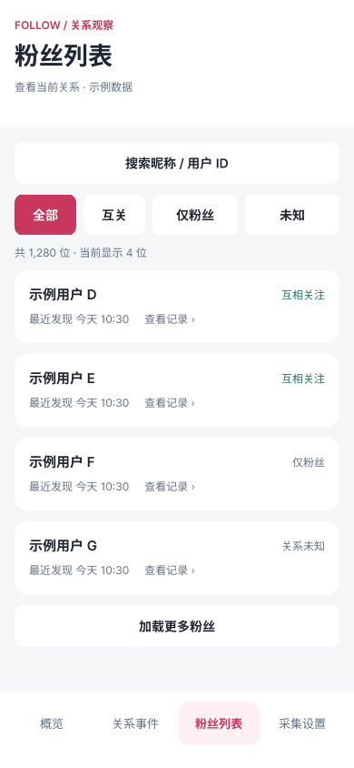
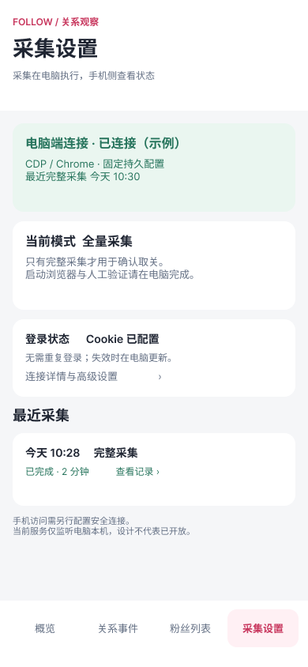
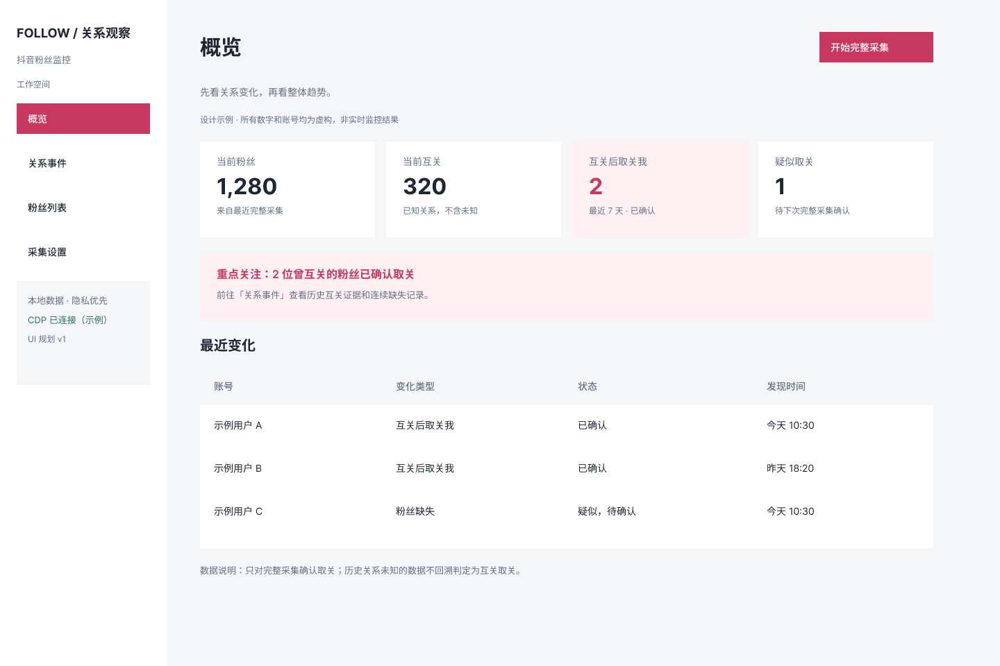
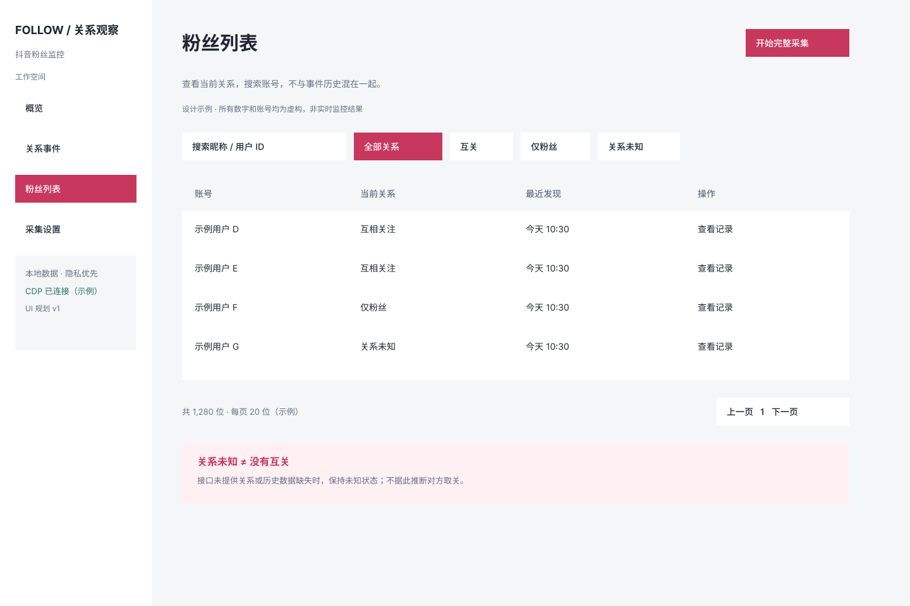
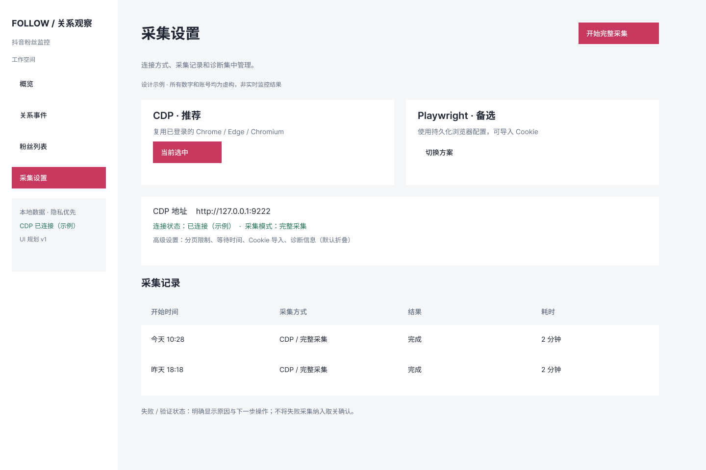

# 网页 UI 设计

[返回项目首页](../../README.md)

设计快照：2026-09-05。预览来自本项目 Figma 文件的 PNG 导出，不是运行截图；所有账号、数字、时间和连接状态均为示例。图片随仓库保存，不依赖临时下载链接。

Figma 文件：[抖音粉丝监控 — 多页面 UI 重设计](https://www.figma.com/design/1jeiVJex7CrRUSUNWYJCIa)。编辑稿由本地 TalkToFigma 插件创建，使用可编辑自动布局图层；尚无主组件库或点击原型。访问需要文件所有者授予相应权限，本次文档更新不修改共享权限。

## 页面索引

| 页面 | 桌面 1440 × 960 | 手机 390 × 844 |
| --- | --- | --- |
| 概览 | [Figma](https://www.figma.com/design/1jeiVJex7CrRUSUNWYJCIa?node-id=4-3341) · [PNG](assets/desktop-overview.png) | [Figma](https://www.figma.com/design/1jeiVJex7CrRUSUNWYJCIa?node-id=9-3652) · [PNG](assets/mobile-overview.png) |
| 关系事件 | [Figma](https://www.figma.com/design/1jeiVJex7CrRUSUNWYJCIa?node-id=4-3424) · [PNG](assets/desktop-events.png) | [Figma](https://www.figma.com/design/1jeiVJex7CrRUSUNWYJCIa?node-id=9-3692) · [PNG](assets/mobile-events.png) |
| 粉丝列表 | [Figma](https://www.figma.com/design/1jeiVJex7CrRUSUNWYJCIa?node-id=4-3495) · [PNG](assets/desktop-followers.png) | [Figma](https://www.figma.com/design/1jeiVJex7CrRUSUNWYJCIa?node-id=9-3734) · [PNG](assets/mobile-followers.png) |
| 采集设置 | [Figma](https://www.figma.com/design/1jeiVJex7CrRUSUNWYJCIa?node-id=4-3583) · [PNG](assets/desktop-settings.png) | [Figma](https://www.figma.com/design/1jeiVJex7CrRUSUNWYJCIa?node-id=9-3783) · [PNG](assets/mobile-settings.png) |
| 事件详情 | 见关系事件稿 | [Figma](https://www.figma.com/design/1jeiVJex7CrRUSUNWYJCIa?node-id=9-3813) · [PNG](assets/mobile-event-detail.png) |

## 手机预览

  
  
  

  
  

## 桌面预览

概览

关系事件

粉丝列表

采集设置

## 设计与实现对照

| 设计意图 | 当前代码状态 |
| --- | --- |
| 四个页面、重点关注互关后取关 | 已实现；关系事件默认选择互关后取关我 |
| 宽屏布局 | 已实现自适应铺满，不限定为稿件的 1440px |
| 手机底部导航、卡片列表 | 已实现于 ≤600px；事件、粉丝、采集记录均使用卡片 |
| 事件详情 | 已实现可关闭弹层；只展示已有记录，不虚构历史时间线 |
| 当前互关总数 | 尚无对应全量汇总接口，概览保留真实新增指标 |
| 日期筛选底部面板、加载更多 | 尚未实现；当前使用已有类型/关系筛选、搜索和分页控件 |
| 手机采集设置 | 显示状态摘要；启动浏览器、Cookie 管理、人工验证留在电脑端 |
| Figma 点击原型与主组件库 | 尚未配置；当前为静态、可编辑自动布局稿 |

## 实现与维护

- 页面及数据绑定：[App.tsx](../../web/src/App.tsx)；响应式布局：[styles.css](../../web/src/styles.css)。
- 浏览器回归：[dashboard-smoke.test.mjs](../../scripts/dashboard-smoke.test.mjs)。运行 `npm run test:dashboard`；浏览器版本升级后，可能需要先安装对应 Playwright Chromium。
- 设计图只作为布局与交互参考，功能和数据边界以当前代码为准。检测时间不等于实际取关时间；未知关系不回溯判定为互关。
- 手机稿中的“已连接”不表示已开通手机远程访问。服务默认仅监听本机，安全接入需另行设计，不应向公网开放 CDP。
- 修改设计后同步更新本目录 PNG、节点链接及实现对照。只提交虚构设计数据，禁止用包含真实粉丝或 Cookie 的运行截图替换。
